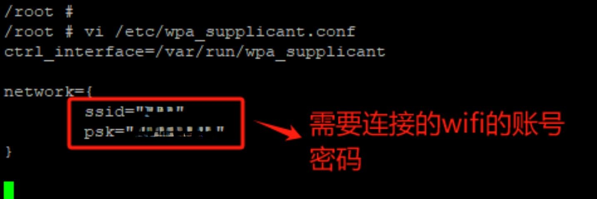

# 扩展板的使用说明

**AXera_Pi Zero**增加4G无线通讯板（简称：扩展板），支持4G/WIFI/SD卡。 

使用不同的模式，天线安装位置也不同，具体的连接位置如图。 

## SD卡使用

1.插入SD卡后，进入终端查看是否存在SD卡分区。 

2.进行SD卡的格式化。 

3.创建需要放置的文件夹。 

4.将SD卡挂载到创建的文件夹中。 

5.输入命令，查看是否挂载成功。 

6.如需挂载到其他位置，先卸载原来挂载位置后，按照第5步确认是否卸载成功，再从第1步开始操作。 

## 切换4G模式

<b>在进行4G/WIFI模式切换时，需要通过网线/串口线连接进入，此时Type-C线只作供电功能，跳线帽切换时需在断电状态下进行。</b>

1.连接网线和Type-C线，<a href="https://axera-pi-zero-docs-cn.readthedocs.io/zh-cn/latest/doc_guide_faq.html">配置设备IP</a>。

2.断开Type-C线，将主板的跳线帽置于WIFI端。(在进行烧录下载时，需把跳线帽置于TYPEC端) 

3.将扩展板的跳线帽置于LTE端，插入4G卡，切换成4G模式。 

4.连接Type-C线，打开putty，通过配置好的IP进入设备终端。 

5.切换到OTG。 

6.输入命令，若出现以下图片所示情况，说明OTG切换成功。 

7.通过拨号工具进行拨号(无需停止，回车进入下一步)。 

8.验证4G卡是否能正常使用。 

## 切换WIFI模式

1.与切换4G模式的第1、2点相同。 

2.将扩展板的跳线帽置于WIFI端，切换成WIFI模式。 

3.与切换4G模式的第4、5点相同。 

4.下载WIFI驱动，需等待一段时间。 

5.输入命令，若出现以下图片所示情况，说明WIFI驱动下载成功。 

6.手动拉起WIFI的网络接口。 

7.通过命令确认WIFI网络接口是否拉起成功。 

<b>在进行WIFI模式的选择时，只能选择其中一种模式，不支持两种模式共存。</b>

### WIFI的AP模式

1.配置WIFI的hostapd.conf文件。(WiFi名和密码可自行配置) 

2.启动hostapd。(有以下打印，说明启动成功) 

3.配置udhcpd.conf。(网段可自行配置) 

4.为wlan0分配IP地址，默认为网关地址。 

5.启动udhcpd程序。 

6.通过手机连接配置好的WIFI，验证是否成功。 

### WIFI的STA模式

1.配置wpa_supplicant.conf文件。 

2.在后台启动wpa_supplicant服务。 

3.扫描并获取周边可用wifi热点，确认需要连接的wifi热点在其中。 

4.通过命令自动获取wifi热点分配的IP地址。 

5.验证设备是否能上网。 

