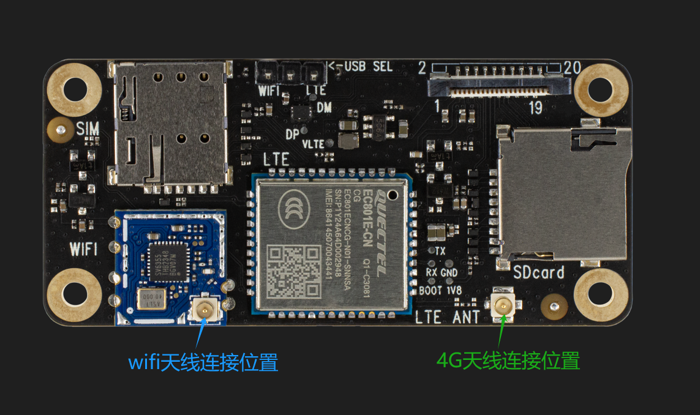

# 扩展板的使用说明

AXera_Pi Zero增加4G无线通讯板（简称：扩展板），支持4G/WIFI/SD卡。 

<b>在进行4G/WIFI模式切换时，需要通过网口/串口进入，此时usb只作供电功能，跳线帽切换时需在断电状态下进行。</b>

## 切换4G模式

1.将主板的跳线帽置于WIFI端。(在进行烧录下载时，需把跳线帽置于TYPEC端) 

2.将扩展板的跳线帽置于LET端，即为4G模式。 

2.进入设备终端，输入命令，切换到OTG。 

3.输入命令，若出现以下图片所示情况，说明OTG切换成功。 

4.输入命令，通过移远拨号工具进行拨号。 

5.用usb0 ping外网验证4G卡是否能正常使用 

## 切换WIFI模式

