# 应用开发 Demo

## FRTDemo 的使用

1.使用Type-C将爱芯派Zero与电脑连接，可通过两种方式进入终端
	
a.通过串口直接进入

	
b.通过<a href="https://axera-pi-zero-docs-cn.readthedocs.io/zh-cn/latest/doc_guide_faq.html">修改IP</a>,使用网线将设备与电脑相连进入

<b>若需要播放视频流，必须修改IP，才可查看</b>

2.打开putty,输入设备对应串口/IP，点击Open 

3.进入后输入用户密码，进入终端(密码不作显示） 
用户名：root 
密码：123456 

4.输入命令进入FRTDemo 
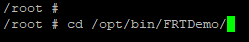

5.输入命令开始启动Demo(-s后的参数为数字1) 

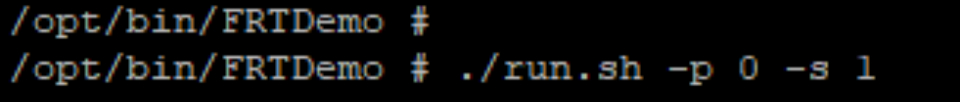

6.打开网页,将运行内容中的URL输入到网址框中
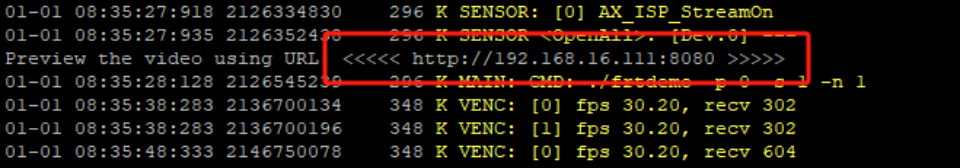

7.在Demo对应的网页中进行登录即刻预览

若需FRTDemo源码，请点击<a href="https://github.com/AXERA-TECH/ax620q_bsp_sdk">此处</a>进行查看 
 
 

## NFS 的挂载

1.点击<a href="https://pan.baidu.com/s/1ZhK5TAt4H6BPRn4bDA1oXA">此链接</a>下载nfs服务器工具 
提取码：Zero 

2.将安装包内的exports文件替换掉nfs所在的路径下
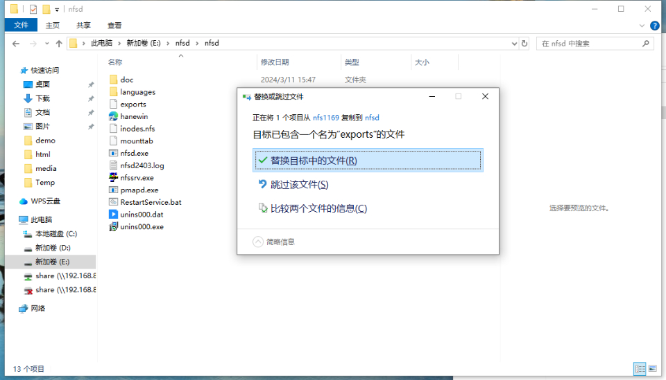

4.在桌面打开nfs服务器，点击输出，点击编辑输出表文件，将设备对应的IP及需共享目录填入文件中，点击重启服务器 
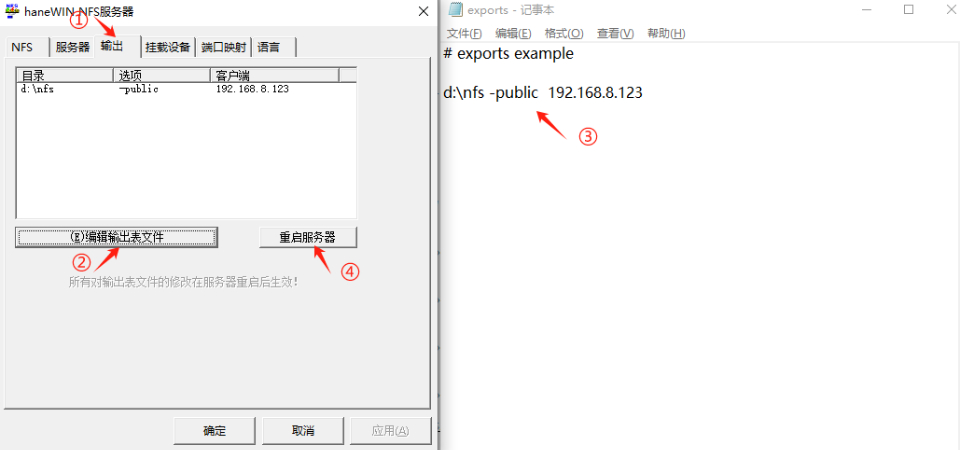

5.创建编辑输出表文件中共享目录对应的目录 
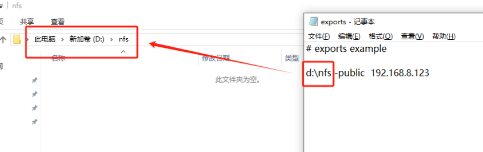

6.打开“计算机管理”，点击服务，找到NFS Server，右键选择重新启动 
（若重启后处于停止状态，可通过重启电脑恢复） 
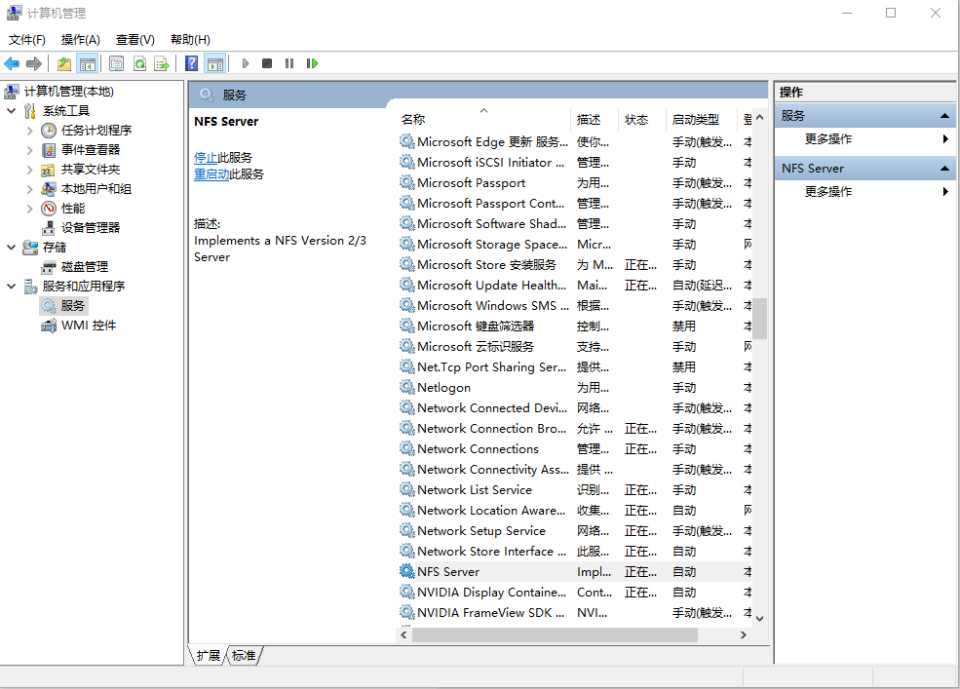

7.重启完成后，打开nfs服务器，点击输出，出现此配置说明nfs服务已开启 
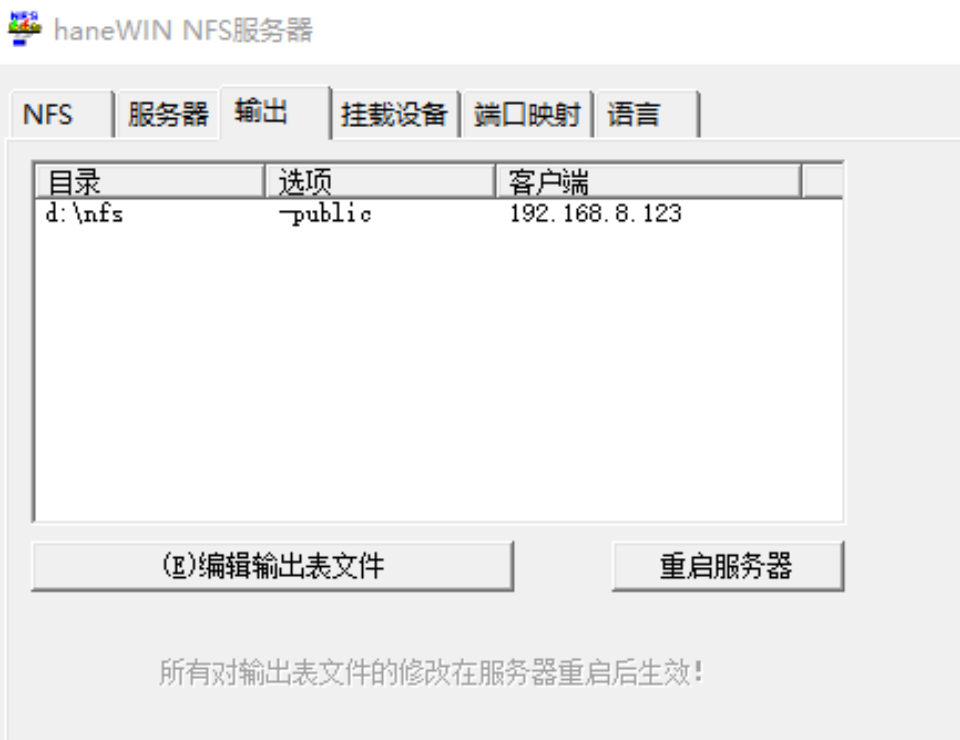

8.将设备通过网线与电脑连接，打开网络配置，点击更改适配器，找到设备对应的以太网，右键属性，修改IPv4 
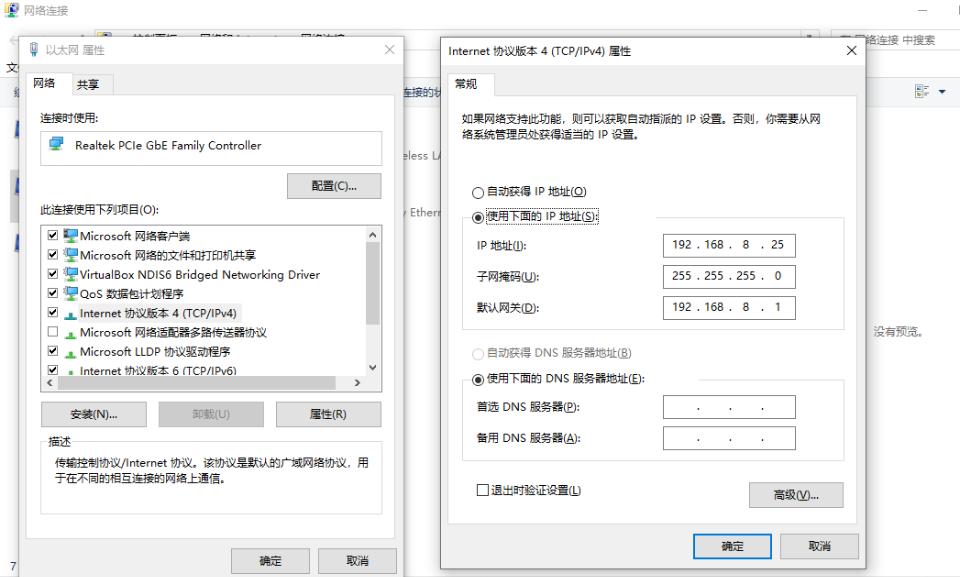

9.windows和设备端互相ping，若可ping通，说明网络配置成功。(若设备端ping不通，可将防火墙关闭) 
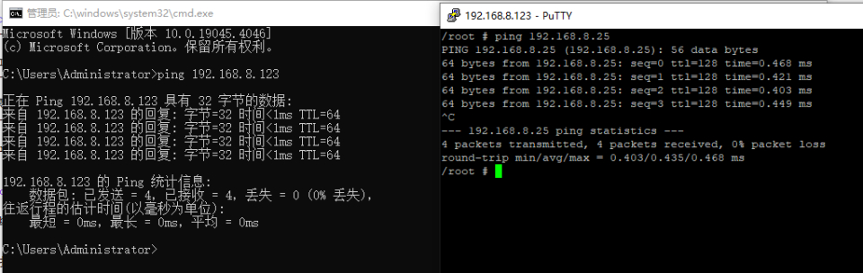

10.输入命令进行nfs挂载 
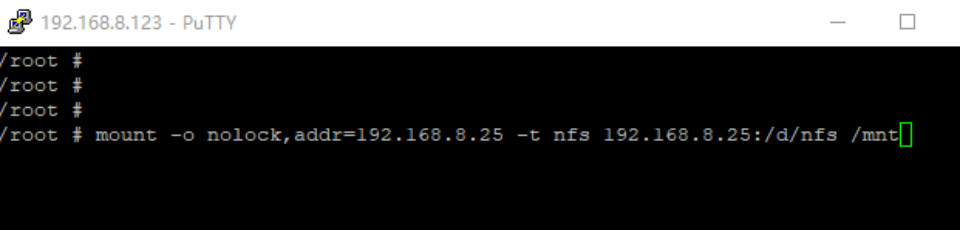

11.可在挂载目录中创建文件验证是否挂载成功