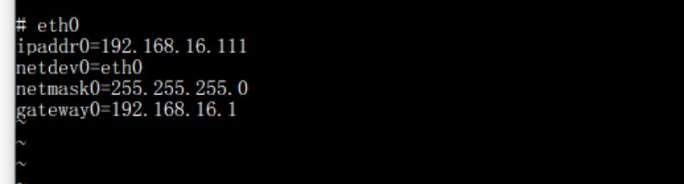

# FAQ

## IP 修改

1.通过Type-C线将爱芯派Zero与电脑进行连接 

2.查看"计算机管理"确认设备对应的串口

3.打开putty，输入设备所对应的串口,点击Open 

4.进入后输入用户密码，进入终端(密码不作显示） 
用户名：root 
密码：123456 

5.输入命令后修改IP 

6.修改所需ip后进行保存 
 
 
 

7.修改完成后重启即刻生效 
 
<b>(PS:也可通过DHCP自动分配IP)</b>

点击<a href="https://pan.baidu.com/s/1ZhK5TAt4H6BPRn4bDA1oXA">此处</a>下载putty 
提取码：Zero

## 社区资料

若有其他的问题，可进群询问。 
QQ:139953715
